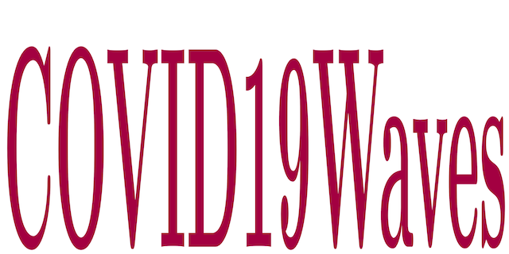

**mWaves** repository stores a Matlab package that can be used to fit a multi-wave statistical model to the complex epidemic data. The repository also contains data referring to a case study involving the city of Rio de Janeiro in Brazil. More details in the following papers:
- *A. Cunha Jr, F. C. Batista, P. R. L. Gianfelice, R. S. Oyarzabal, J. M. V. Grzybowsk, and E. E. N. Macau, mWaves: A code for fitting multi-wave epidemic models, 2022*
- *P. R. L. Gianfelice, R. S. Oyarzabal, A. Cunha Jr, J. M. V. Grzybowsk, F. C. Batista, and E. E. N. Macau, The starting dates of COVID-19 multiple waves, Chaos, 32:031101, 2022 https://doi.org/10.1063/5.0079904*

## Authors
- Americo Cunha Jr
- Fernando da Conceição Batista
- Paulo Roberto de Lima Gianfelice
- Ricardo Sovek Oyarzabal
- Jose Mario Vicensi Grzybowsk
- Elbert E. N. Macau

## Citing this study
We ask the code users to cite the following manuscripts in any publications reporting work done with our code:
- *A. Cunha Jr, F. C. Batista, P. R. L. Gianfelice, R. S. Oyarzabal, J. M. V. Grzybowsk, and E. E. N. Macau, mWaves: A code for fitting multi-wave epidemic models, 2022*
- *P. R. L. Gianfelice, R. S. Oyarzabal, A. Cunha Jr, J. M. V. Grzybowsk, F. C. Batista, and E. E. N. Macau, The starting dates of COVID-19 multiple waves, Chaos, 32:031101, 2022 https://doi.org/10.1063/5.0079904*

```
@article{mWaves2022,
   author  = {A {Cunha~Jr} and F C Batista and P. R. L. Gianfelice and R S Oyarzabal and J M V Grzybowsk and E E N Macau},
   title   = {mWaves: A code for fitting multi-wave epidemic models},
   journal = {~},
   year    = {2022},
   volume  = {~},
   pages   = {~},
   note    = {~},
}
```

```
@article{COVID19Waves2022,
   author  = {P. R. L. Gianfelice and R S Oyarzabal and A {Cunha~Jr} and J M V Grzybowsk and F C Batista and E E N Macau},
   title   = {The starting dates of COVID-19 multiple waves},
   journal = {Chaos},
   year    = {2022},
   volume  = {32},
   pages   = {031101},
   note    = {https://doi.org/10.1063/5.0079904},
}
```

## License
**mWaves** is released under the MIT license. See the LICENSE file for details. All new contributions must be made under the MIT license.

## Funding

 &nbsp; &nbsp;   &nbsp; &nbsp;  &nbsp; &nbsp; 
