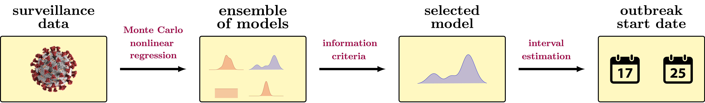

## A code for fitting multi-wave epidemic models

**epidWaves** is a Matlab/Python package designed to fit multi-wave statistical models to complex epidemic data. It is based on a parametric statistical framework that combines surveillance data, nonlinear regression, and information criteria to create a statistical model capable of describing multi-wave epidemic outbreaks.

<p align="center">

</p>

## Table of Contents
- [Overview](#overview)
- [Features](#features)
- [Usage](#usage)
- [Documentation](#documentation)
- [Reproducibility](#reproducibility)
- [Authors](#authors)
- [Citing epidWaves](#citing-epidwaves)
- [License](#license)
- [Institutional Support](#institutional-support)
- [Funding](#funding)

### Overview
**epidWaves** was developed to address the need for robust modeling of multi-wave epidemic data. By integrating surveillance data with nonlinear regression and information criteria, the package offers a comprehensive solution for fitting complex epidemic models. This tool is particularly useful for researchers and public health officials working to understand and predict the dynamics of epidemic outbreaks.

This package emerged from the combination of several codes used by authors in different publications:
- **A. Cunha Jr, F. C. Batista, P. R. L. Gianfelice, R. S. Oyarzabal, J. M. V. Grzybowsk, and E. E. N. Macau**, *epidWaves: A code for fitting multi-wave epidemic models*, 14:100391, 2022 <a href="https://doi.org/10.1016/j.simpa.2022.100391" target="_blank">DOI</a>
- **P. R. L. Gianfelice, R. S. Oyarzabal, A. Cunha Jr, J. M. V. Grzybowsk, F. C. Batista, and E. E. N. Macau**, *The starting dates of COVID-19 multiple waves*, Chaos, 32:031101, 2022 <a href="https://doi.org/10.1063/5.0079904" target="_blank">DOI</a> 
- **Pavlack et al.**, *EPIDEMIC - Epidemiology Educational Code*, Journal of Open Source Education, 5(50), 149, 2022 <a href="https://doi.org/10.21105/jose.00149" target="_blank">DOI</a>
- **F. Batista, A. Cunha Jr.**, *Inferência dos Estágios Iniciais da COVID-19 em Portugal*, In: XXIII Congresso Brasileiro de Automática (CBA 2020), 2020, Congresso Virtual, Brazil. <a href="https://doi.org/10.48011/asba.v2i1.978" target="_blank">DOI</a>

### Features
- Fits multi-wave statistical models to epidemic data
- Combines surveillance data, nonlinear regression, and information criteria
- Supports both Matlab and Python implementations
- Educational style for ease of use
- Includes example scripts for representative benchmark tests

### Usage
To get started with **epidWaves**, follow these steps:

#### Matlab
1. Clone the repository:
   ```bash
   git clone https://github.com/americocunhajr/epidWaves.git
   ```
2. Navigate to the code directory:
   ```bash
   cd epidWaves/epidWaves-1.0/epidWaves_Matlab
   ```

#### Python
1. Clone the repository:
   ```bash
   git clone https://github.com/americocunhajr/epidWaves.git
   ```
2. Navigate to the code directory:
   ```bash
   cd epidWaves/epidWaves-1.0/epidWaves_Python
   ```

### Documentation
**epidWaves** routines are well-commented to explain their functionality. Each routine includes a description of its purpose and a list of inputs and outputs. Examples cases  are provided to illustrate the code's functionality.

### Reproducibility
Curve fittings done with **epidWaves** in the Chaos paper are fully reproducible, as can be seen on this <a href="https://codeocean.com/capsule/0219197/tree/v5" target="_blank">CodeOcean capsule</a>

### Authors
- Americo Cunha Jr
- Fernando da Conceição Batista
- Paulo Roberto de Lima Gianfelice
- Ricardo Sovek Oyarzabal
- Jose Mario Vicensi Grzybowsk
- Elbert E. N. Macau

### Citing epidWaves
If you use **epidWaves** in your research, please cite the following manuscripts:
- *A. Cunha Jr, F. C. Batista, P. R. L. Gianfelice, R. S. Oyarzabal, J. M. V. Grzybowsk, and E. E. N. Macau, epidWaves: A code for fitting multi-wave epidemic models, 14:100391, 2022 https://doi.org/10.1016/j.simpa.2022.100391*
- *P. R. L. Gianfelice, R. S. Oyarzabal, A. Cunha Jr, J. M. V. Grzybowsk, F. C. Batista, and E. E. N. Macau, The starting dates of COVID-19 multiple waves, Chaos, 32:031101, 2022 https://doi.org/10.1063/5.0079904*

```
@article{epidWaves2022,
   author  = {A {Cunha~Jr} and F C Batista and P. R. L. Gianfelice and R S Oyarzabal and J M V Grzybowsk and E E N Macau},
   title   = "{epidWaves: A code for fitting multi-wave epidemic models}",
   journal = {Software Impacts},
   year    = {2022},
   volume  = {14},
   pages   = {100391},
   note    = {10.1016/j.simpa.2022.100391},
}
```

```
@article{Gianfelice2022p031101,
   author  = {P. R. L. Gianfelice and R S Oyarzabal and A {Cunha~Jr} and J M V Grzybowsk and F C Batista and E E N Macau},
   title   = "{The starting dates of COVID-19 multiple waves}",
   journal = {Chaos},
   year    = {2022},
   volume  = {32},
   pages   = {031101},
   note    = {10.1063/5.0079904},
}
```

### License
**epidWaves** is released under the MIT license. See the LICENSE file for details. All new contributions must be made under the MIT license.

 

### Institutional support

 &nbsp; &nbsp;  &nbsp; &nbsp;  &nbsp; &nbsp;  

### Funding

 &nbsp; &nbsp;   &nbsp; &nbsp;  &nbsp; &nbsp; 
